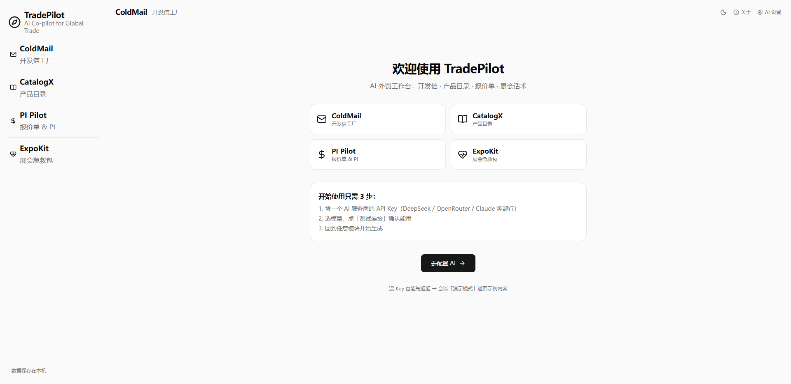
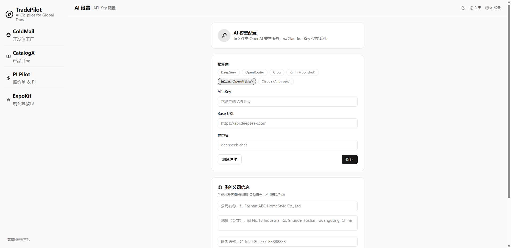
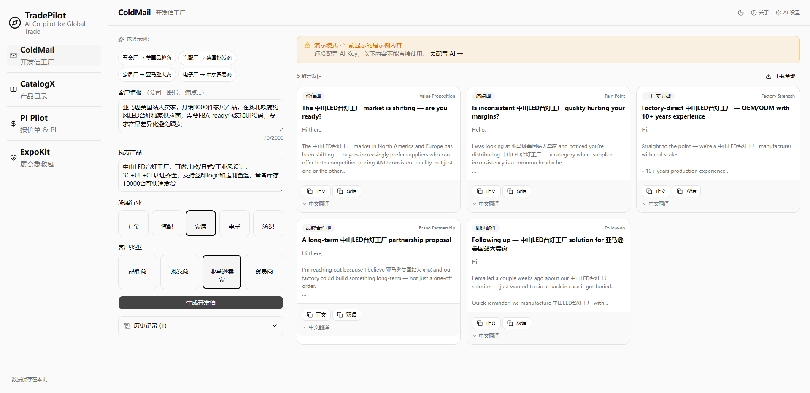
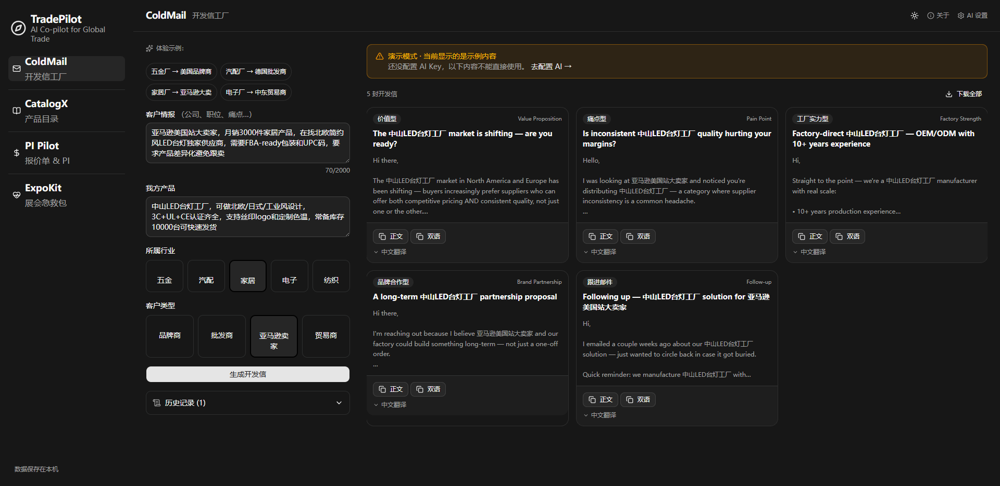

<div align="center">

# 🧭 TradePilot — AI 外贸工作台

一个开箱即用的 **Windows 桌面应用**，让外贸工厂老板/业务员用 AI 直接生成：**英文开发信、产品目录、Proforma Invoice 报价单、展会话术**。

纯本地运行 · 数据不出本机 · 自带演示模式 · **MIT 开源**

[](LICENSE)


</div>

---

## ✨ 它能做什么

| 模块 | 作用 |
|---|---|
| ✉️ **ColdMail 开发信工厂** | 输入客户情报 + 产品信息，AI 生成 **5 封不同策略**的英文开发信（含中文翻译），直达发送 |
| 📋 **CatalogX 产品目录** | 输入中文产品参数，生成买家可直接使用的英文产品目录页 |
| 💵 **PI Pilot 报价单** | 生成 Proforma Invoice，自动核对金额、附 Incoterms 说明 |
| 🎪 **ExpoKit 展会急救包** | 展会现场 3 分钟搞定：临时调价 / 换配置 / 加新品 / 紧急报价话术 |

内置 **5 大行业知识库**（五金 / 汽配 / 家居 / 电子 / 纺织），自动注入行业术语与认证（ISO9001 / FOB / MOQ / CE…），让邮件读起来像真实工厂发的，而不是 AI 腔。

## 📸 界面

| 首次启动引导 | AI 配置 |
|---|---|
|  |  |

| 生成开发信（演示模式） | 深色主题 |
|---|---|
|  |  |

## 🚀 快速开始

### 直接使用（免构建）

1. 下载 Windows 安装包（`Release` 页面），双击安装
2. 打开 TradePilot → 「去配置 AI」→ 选服务商、粘贴你的 API Key、点「测试连接」
3. 回到任意模块开始生成

> 没 Key 也能先体验：会以**演示模式**返回示例内容（界面有醒目提示，不会误当真邮件）。

### 接入任意 AI 模型

**任何 OpenAI 兼容服务**都能接入（自带预设，也可自定义 baseURL + 模型名）：

| 服务商 | 预设 |
|---|---|
| DeepSeek | ✅ `api.deepseek.com` / `deepseek-chat` |
| OpenRouter | ✅ |
| Groq | ✅ |
| Kimi (Moonshot) | ✅ |
| 自定义 OpenAI 兼容 | ✅ 任意 baseURL + 模型名 |
| Claude (Anthropic) | ✅ 官方 API |

配置保存在本机 `config.json`，切换服务商无需重装。

## 🔒 隐私

- API Key 与公司信息**只存在你电脑**，不上传、不进代码库
- 历史记录存本机，重开不丢
- AI 请求**直接**发给你选的模型服务商，不经过任何第三方服务器
- 卸载后数据留在 `%APPDATA%/tradepilot`，如需彻底清除请手动删除该目录

## 🛠 从源码构建

```bash
# 1. 装依赖（Electron 二进制境内下载慢，可先设镜像）
export ELECTRON_MIRROR="https://npmmirror.com/mirrors/electron/"
export ELECTRON_BUILDER_BINARIES_MIRROR="https://npmmirror.com/mirrors/electron-builder-binaries/"
npm install
npm --prefix web install

# 2. 构建前端静态页 + 打包 Windows 安装包
npm run dist
```

> `dist` 自动完成：web 静态导出 → Electron 打包 → 注入图标（`scripts/set-icon.js`）→ 生成 NSIS 安装包。自定义图标放 `build/icon.ico`。
>
> 产物在 `release/`。无签名安装包 SmartScreen 会提示「未知发布者」→「更多信息」→「仍要运行」。

## 🏗 技术栈

```text
Electron       桌面壳（本地 HTTP + 窗口，单进程无原生依赖）
Next.js        前端（静态导出，shadcn/ui）
Express       本地后端（同源 /api）
OpenAI SDK    任意 OpenAI 兼容服务 + Anthropic SDK
```

```
main.js              Electron 主进程
server/              Node 后端（Express + LLM 调度 + 行业知识库）
web/                 Next.js 前端（静态导出）
```

## 📜 License

[MIT](LICENSE) — 自由使用、修改、商用。
